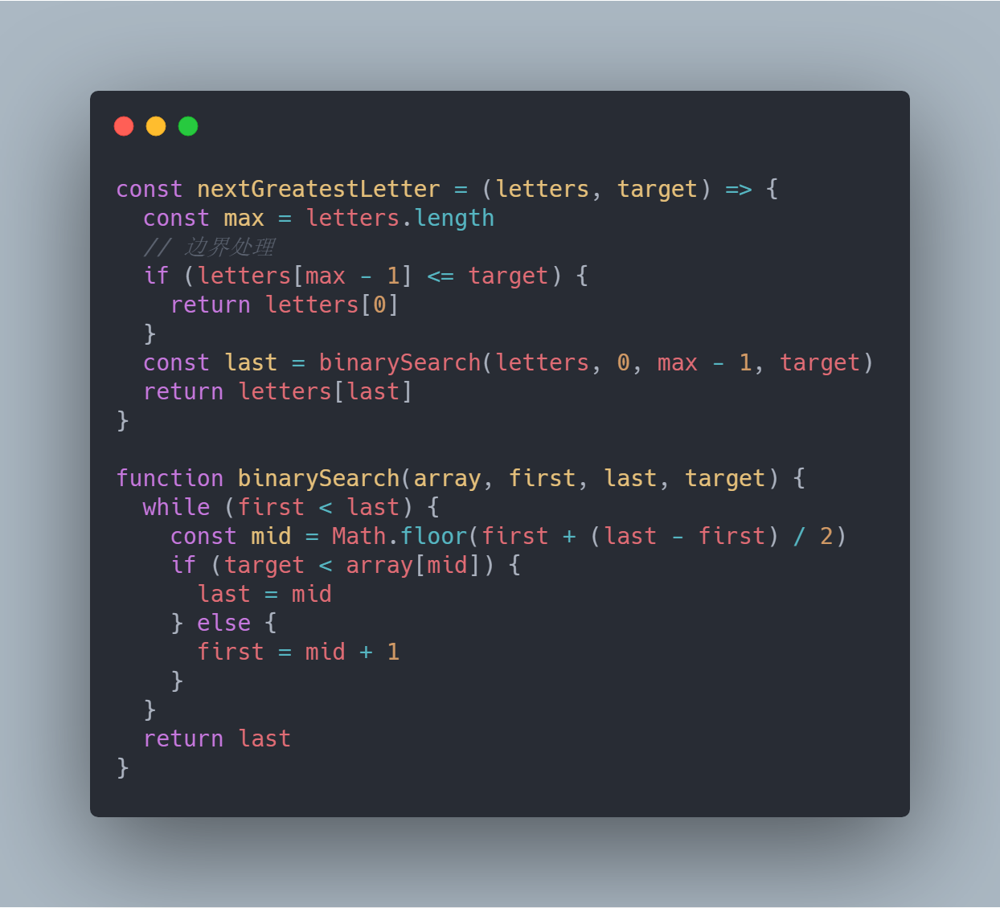
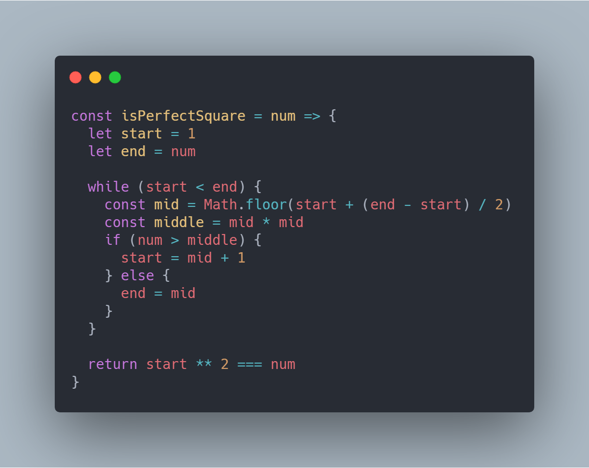
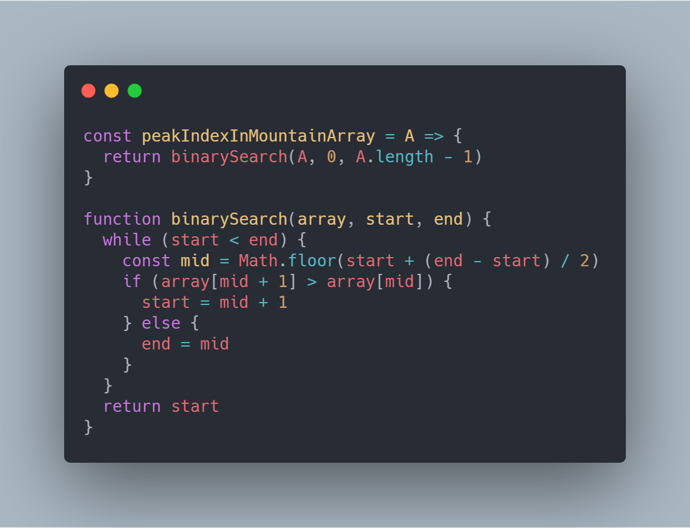
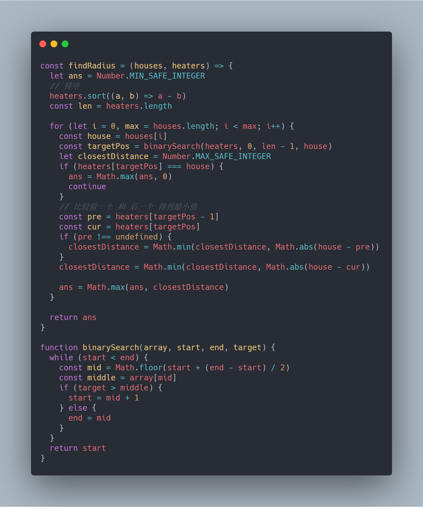

# 一只前端的 LeetCode 之旅 -- 二分搜索（Easy篇）

### 一、二分搜索算法

##### 1、基本认知

  &emsp;&emsp;二分搜索是一种在有序数组中查找某一特定元素的搜索算法。

  

  &emsp;&emsp;二分搜索算法的时间复杂度为 O(log n)，相比较顺序搜索的 O(n) 时间复杂度，它是非常快的。

  &emsp;&emsp;例如，在一个长度为一百万的有序数组中，采用顺序搜索，最坏的情况需要执行一百万次，而二分搜索算法则只需要二十次！

  &emsp;&emsp;从上图中，读者可以发现，二分搜索的关键就是通过目标值与中间值的比较，将搜索区间缩小一半，这也是为什么有序数组是二分搜索算法的重要前提。

##### 2、代码实现

  &emsp;&emsp;由前文可知，二分搜索并不是一个特别的复杂的算法，但是想通过代码实现它，并不是一件易事。

  &emsp;&emsp;一般二分搜索都是作用于数组上，所以要先求出数组的中间下标（整数），从而获取到中间值：

```JavaScript
  const mid = Math.floor((start + end) / 2)
```

  &emsp;&emsp;读者可能第一时间想到的就是上述写法，但是在一些极端的情况，start + end 可能直接超出最大的安全整数，所以更加的谨慎的写法如下：

```JavaScript
  const mid = Math.floor(start + (end - start) / 2)
```

  &emsp;&emsp;最后就是搜索区间如何不断缩小一半，对于很多初学者来说，经常会将其写成一个死循环，这里保持搜索区间左闭右开的写法：

```JavaScript
while (start < end) {
  const mid = Math.floor(start + (end - start) / 2)
  if (arr[mid] < target) {
    start = mid + 1
  } else {
    end = mid
  }
}
```

### 二、LeetCode 实战

##### 1、744. 寻找比目标字母大的最小字母

  &emsp;&emsp;这道题目主要考察二分搜索算法的基本实现：

  

##### 2、367. 有效的完全平方数

  &emsp;&emsp;这道题目需要如下两个技巧：
  
- 如果 num 为完全平方数，那么能形成该完全平方数的整数必定存在 [1, num) 区间，是不是有序数组的前提条件有了；
- 取得 [1, num) 区间的中间值时，需要进行平方运算后再与 num 比较；

  

&emsp;&emsp;类似解题思路的题目还有[【69. x 的平方根】](https://leetcode-cn.com/problems/sqrtx/)和[【441. 排列硬币】](https://leetcode-cn.com/problems/arranging-coins/)。

##### 3、852. 山脉数组的峰顶索引

  &emsp;&emsp;仔细读题之后，你会发现给定的数组并非有序数组，但是需要查找目标数字恰巧处于一个很特殊的位置，当我们从当前区间查找到中间值时，可以通过与前一个数或者后一个数的比较，可以判断当前中间值处于递增还是递减区间，从而判断峰值处于左半区间还是右半区间：

  

##### 6、475. 供暖器

  &emsp;&emsp;这道题的难点在于是否读懂了题目：找到一个最小半径使得加热器覆盖所有房子。

  &emsp;&emsp;那么最简单的解法就是遍历所有的房子的同时，遍历加热器找出距离该房子的最小距离，那么所有房子中的最大距离即为加热器覆盖的最小半径，那么整个过程的时间复杂度就是 O(n*m)，对于加热器的搜索可以采用二分搜索算法优化，那么时间复杂度可以优化为 O(nlog m):

  


### 写在最后

  &emsp;&emsp;算法作为计算机的基础学科，用 JavaScript 刷，一点也不丢人ε=ε=ε=┏(゜ロ゜;)┛。

  &emsp;&emsp;本系列文章会分别给出一种算法的3种难度的总结篇（简单难度，中等难度以及困难难度），如果本文对您有所帮助，可以点赞或者关注来鼓励博主。
  

- [一只前端的 LeetCode 之旅](https://github.com/15751165579/LeetCode)

