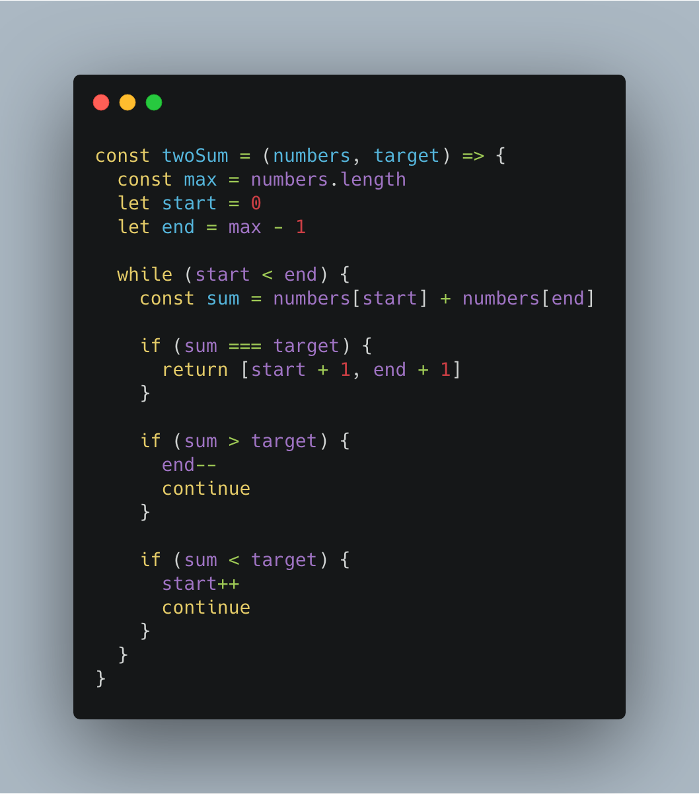
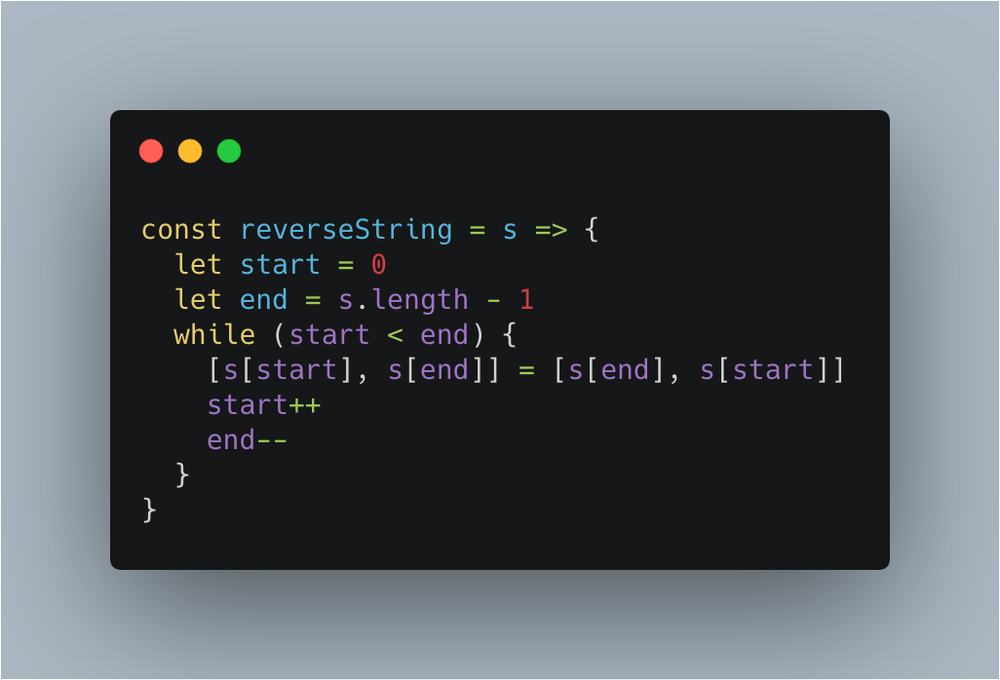
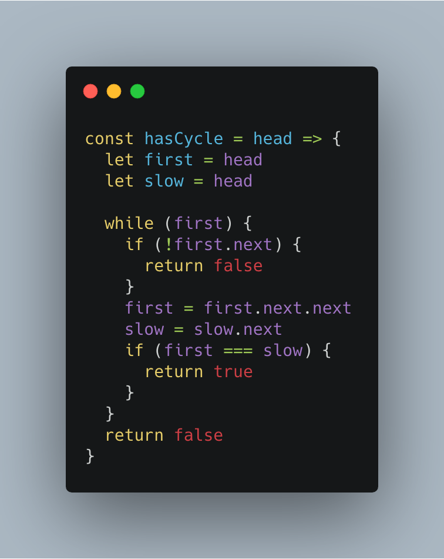
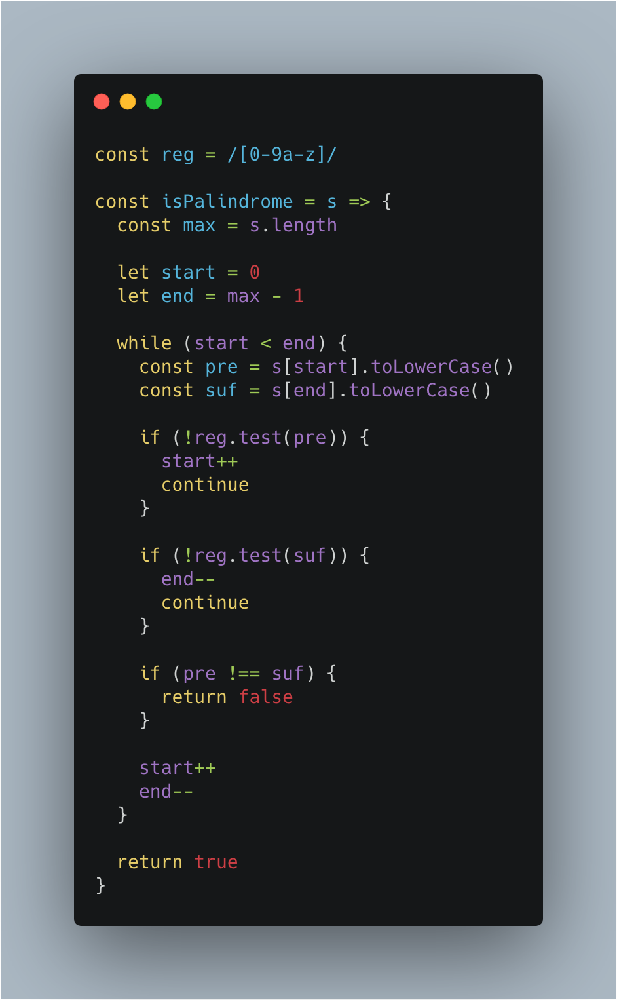
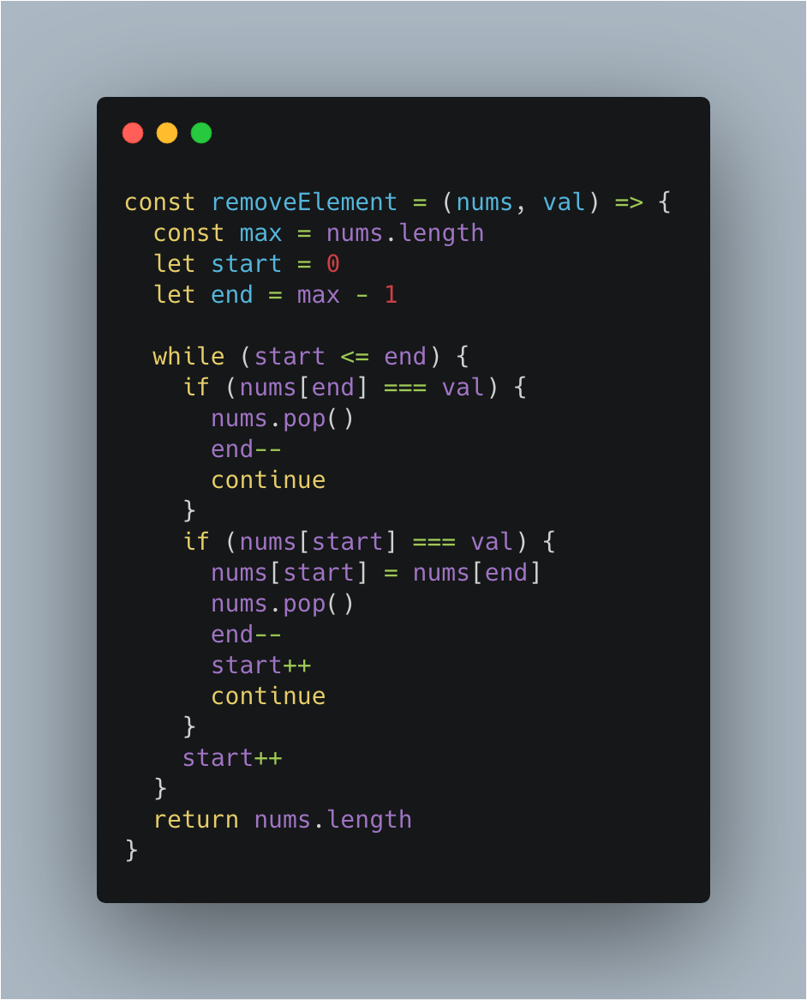

# 前端工程师的 LeetCode 之旅 -- 双指针技巧 Easy 篇

### 一、前言

  &emsp;&emsp;一般情况下，遍历数组（或者字符串）操作，都是采用单指针从前往后或者从后往前依次访问数组（或者字符串）中的元素。

  - 找到两个数使得它们相加之和等于目标数，采用单指针处理，需要嵌套循环；
  - 翻转数组，采用单指针处理，需要额外空间；

  &emsp;&emsp;这种情况下就需要利用双指针技巧：

  - 先对采用数组进行排序预处理，采用前后指针向中间遍历，遍历的时间复杂度为 O(n)，整体处理的事件复杂度主要取决于排序，通常为 O(nlogn)；
  - 一个指针负责遍历，一个指针负责交换元素，从而使得空间复杂度为 O(1)；

  &emsp;&emsp;下面通过实际的题目感受一下双指针的威力：

### 二、167. 两数之和 II - 输入有序数组

  > 给定一个已按照升序排列 的有序数组，找到两个数使得它们相加之和等于目标数。函数应该返回这两个下标值 index1 和 index2，其中 index1 必须小于 index2。

  &emsp;&emsp;这道题目采用单指针的做法只能通过嵌套循环不断的计算两数之和，时间复杂度 O(n^2)。

  &emsp;&emsp;恰巧本题中的数组已经是有序数组，那么直接创建前后指针：

  - **如果两数之后大于 target，尾指针向前移动；**
  - **如果两数之和小于 target，头指针向后移动；**

  

  &emsp;&emsp;利用双指针技巧，将本题的时间复杂度降低为 O(n)

### 三、344. 反转字符串

  > 编写一个函数，其作用是将输入的字符串反转过来。输入字符串以字符数组 char[] 的形式给出。不要给另外的数组分配额外的空间，你必须原地修改输入数组、使用 O(1) 的额外空间解决这一问题。你可以假设数组中的所有字符都是 ASCII 码表中的可打印字符。

  &emsp;&emsp;本题采用单指针的方法，需要创建一个额外的数组来保存翻转后的元素。

  &emsp;&emsp;**利用双指针技巧，则可以在遍历的过程中同时完成交换元素的操作，时间复杂度降低为 O(1)**：

  

  &emsp;&emsp;相同类型的题目还有：

  - 【345. 反转字符串中的元音字母】

### 四、141. 环形链表

  > 给定一个链表，判断链表中是否有环。为了表示给定链表中的环，我们使用整数 pos 来表示链表尾连接到链表中的位置（索引从 0 开始）。 如果 pos 是 -1，则在该链表中没有环。

  &emsp;&emsp;在链表这种数据结构中，采用前文所说的前后指针并不一定有效（例如单向链表），这种情况下，双指针的表现形式为：**快慢指针**。

  &emsp;&emsp;快慢指针指的是：设置两个前进方向相同但速度不同的指针。

  &emsp;&emsp;本题中，设置每次移动一个单位的慢指针和每次移动两个单位的快指针，那么他们必定会在环内相遇：

  

  &emsp;&emsp;相同类型的题目还有：

  - 【26. 删除排序数组中的重复项】

### 五、125. 验证回文串

  > 给定一个字符串，验证它是否是回文串，只考虑字母和数字字符，可以忽略字母的大小写。说明：本题中，我们将空字符串定义为有效的回文串。

  &emsp;&emsp;回文字符串问题是双指针的经典应用，同时也是面试题中的常客。

  

### 六、27. 移除元素

  > 给定一个数组 nums 和一个值 val，你需要原地移除所有数值等于 val 的元素，返回移除后数组的新长度。不要使用额外的数组空间，你必须在原地修改输入数组并在使用 O(1) 额外空间的条件下完成。元素的顺序可以改变。你不需要考虑数组中超出新长度后面的元素。

  &emsp;&emsp;显而易见的解决方法是通过 while + splice 处理，但是 **splice 操作方法是很耗时的，每次删除元素之后，需要重排数组中的元素**，具有相同副作用的操作方法还有 unshift 和 shift 。（具体可以查看 V8 相关方法的实现）

  &emsp;&emsp;相比较下，pop 和 push 则是非常快的操作方法，这里可以采用双指针 + pop 操作方法，进一步优化时间复杂度：

  

### 写在最后

  &emsp;&emsp;算法作为计算机的基础学科，用 JavaScript 刷，一点也不丢人ε=ε=ε=┏(゜ロ゜;)┛。

  &emsp;&emsp;本系列文章会分别给出一种算法的3种难度的总结篇（简单难度，中等难度以及困难难度）。在简单难度中，会介绍该算法的基本知识与实现，另外两个难度，着重讲解解题的思路。

  &emsp;&emsp;每篇总结中会选取部分重点题目讲解，完整解题清单详见[【前端工程师的 LeetCode 之旅】](https://github.com/15751165579/LeetCode)
  
  &emsp;&emsp;如果本文对您有所帮助，可以点赞或者关注来鼓励博主。

- [前端工程师的 LeetCode 之旅](https://github.com/15751165579/LeetCode)

