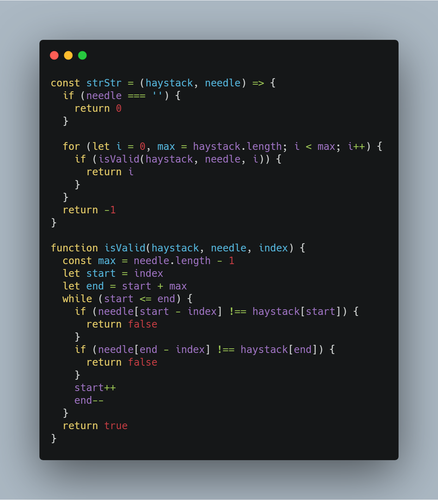

# 前端工程师的 LeetCode 之旅 -- 字符串匹配 KMP 算法

### 一、前言

  > 给定一个 haystack 字符串和一个 needle 字符串，在 haystack 字符串中找出 needle 字符串出现的第一个位置 (从0开始)。如果不存在，则返回  -1。

  &emsp;&emsp;这是双指针 Easy 篇中的【28. 实现strStr()】，虽然是一道 Easy 标签的题目，但是字符串匹配作为计算机科学中研究最广泛的问题之一，相关的算法实现非常多，这里介绍比较常见的 KMP 算法。

### 二、朴素算法

  &emsp;&emsp;在介绍 KMP 算法之前，首先看一下朴素字符串匹配算法的实现：

  

  &emsp;&emsp;上述代码主要的思路是：采用 needle 依次与 haystack 中元素开头的字符串进行匹配，时间复杂度为 O(nm)。

```s
  haystack: ABABABD
    needle: ABABD
```

  &emsp;&emsp;以上述 haystack 和 needle 为例，朴素算法的比较过程为：

  - i = 0时，needle 与 ABABA 不匹配，那么 i 向后移动一位；
  - i = 1时，needle 与

### 三、KMP 算法
